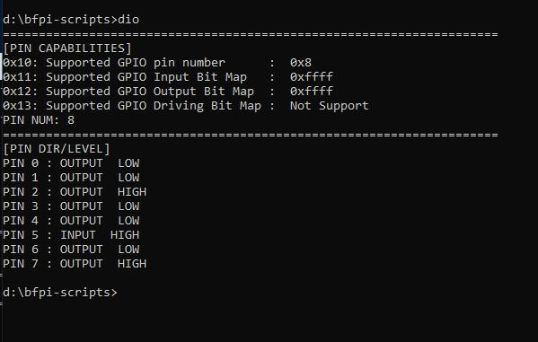
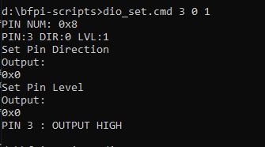
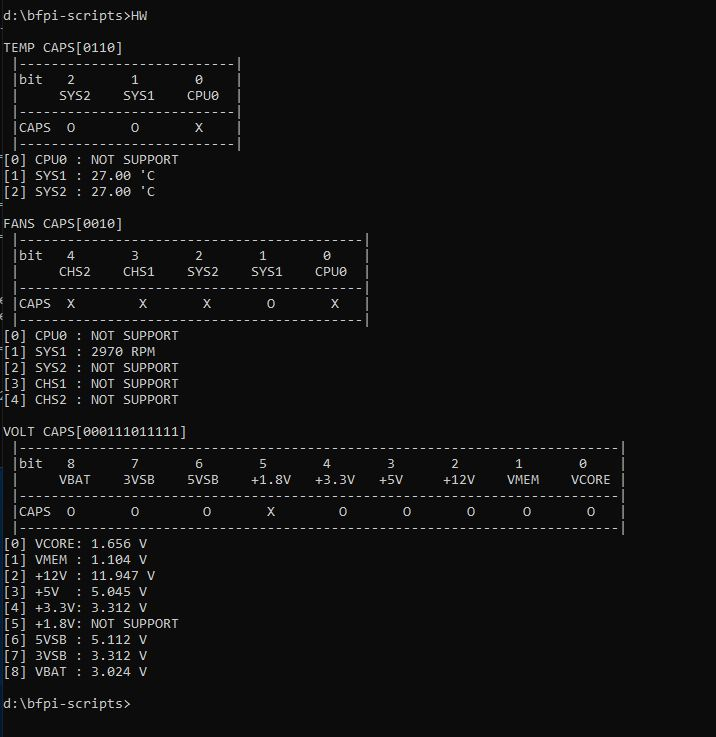

### 檢視DIO狀態

`dio.cmd` or `dio`

### 設定DIO PIN 方向 電位

>             PIN OUT/IN LEVEL
>     dio_set 0-7   0/1   0/1
>
>     dio_set 0-7    0    0/1
> 
>     dio_set 0-7    1    ---
> 若設定為Input (1) 可忽略電位
>
> Ex: `dio_set.cmd 7 0 0` or `dio_set.cmd 7 1`

### 檢視 Hardware Monitor

`hw.cmd` or `hw`

